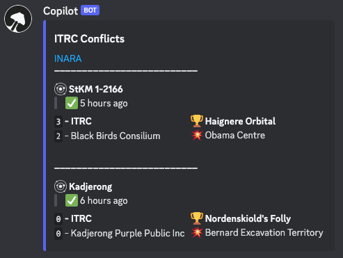

<div align="center">
  
  <h1>Elite Dangerous Copilot</h1>
</div>

<div align="center">
  <a href="https://github.com/jovanblazek/ED-Copilot/issues" target="_blank">
    
  </a>

  <a href="https://github.com/jovanblazek/ED-Copilot" target="_blank">
    
  </a>

  <a href="https://github.com/jovanblazek/ED-Copilot/blob/main/LICENSE" target="_blank">
    
  </a>
</div>

## 🎯 What is Copilot?

Copilot is a discord bot that can help you look up the information you need. Anything from nearest material traders, tick detection, to faction influence details or ongoing conflicts. List of all commands can be found below. Bot currently supports two languages: English and Slovak.

1. Add Copilot to your server
2. Set it up using the `/copilot` command to choose your preferred language, faction and channel for reporting ticks.
3. Enjoy! 🎉

<div align="center">
  <br/>
  <caption>
    Faction conflicts report
  </caption>
</div>

> **Note** \
> Copilot is currently in closed beta so is not possible to invite him to your server yet. (But will be soon!)

## 📡 Commands

| Command             | Description                                                                   |
| ------------------- | ----------------------------------------------------------------------------- |
| `copilot`           | Setup/update preferences (admins only).                                       |
| `faction systems`   | List of systems where your faction is present with current influence & trend. |
| `faction conflicts` | List of ongoing conflicts with details.                                       |
| `system`            | Get info about a system and its factions.                                     |
| `profile`           | Show off your Elite Dangerous profile.                                        |
| `broker`            | Nearest tech brokers.                                                         |
| `trader`            | Nearest material traders.                                                     |
| `factors`           | Nearest interstellar factors.                                                 |
| `distance`          | Calculate distance between two systems.                                       |
| `tick`              | Get the latest tick time.                                                     |
| `setup profile`     | Setup your Elite Dangerous profile.                                           |

---

## Development

### 💻 Environment Setup

1. Create an app with a bot on Discord developer portal
2. Copy `.env.example` file to `.env` file and fill in the values.
3. Set your development server ID and bot token in `.env` file.
4. Install the dependencies with `npm install`.
5. Run `docker-compose up` to start the DB.
6. Run `npm run migrate:dev` to create the tables.
7. Run `npm run register-commands` to register the commands on your testing server.
8. Run `npm run dev` to start the bot.

### 💿 Migrations

After changing the prisma schema, create a migration using following command:

```
prisma migrate dev --name added_column
```

Whenever you make changes to your Prisma schema in the future, you manually need to invoke `prisma generate` in order to accommodate the changes in your Prisma Client API.

### 📖 Translations

To add new languages or update existing translations, run the following command:

```
npm run translations:watch
```

Then you can start editing the translations in `src/i18n` folder. For documentation on how to use the translation library, see [typesafe-i18n documentation](https://github.com/ivanhofer/typesafe-i18n).

---

Spaghetti code, please don't judge. 🙏<br/>
Made with 💗 in free time.
