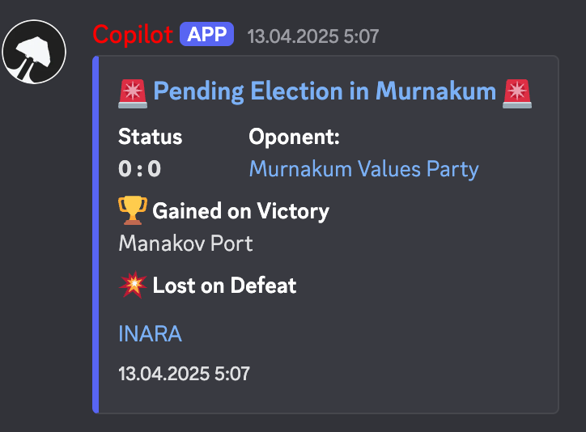

<div align="center">
  
  <h1>Elite Dangerous Copilot</h1>
</div>

<div align="center">
  <a href="https://github.com/jovanblazek/ED-Copilot/issues" target="_blank">
    
  </a>

  <a href="https://github.com/jovanblazek/ED-Copilot" target="_blank">
    
  </a>

  <a href="https://github.com/jovanblazek/ED-Copilot/blob/main/LICENSE" target="_blank">
    
  </a>
</div>

<div align="center">
  <a href="https://discord.com/oauth2/authorize?client_id=1137746612878331975" target="_blank">
    
  </a>
</div>

## 🎯 What is Copilot?

Copilot is a Discord bot for Elite Dangerous that helps you find information quickly. Need to know where the nearest material traders are? Want to check your faction's influence in different systems? Looking for tick times or conflict details? Just ask Copilot.

The bot also keeps an eye on your faction and sends notifications when important stuff happens - like when conflicts are about to start, when you might expand to new systems, or when another faction is getting too close to your influence levels.

1. Add Copilot to your server
2. Set it up using the `/copilot` command to choose your preferred language, faction and channel for reporting ticks.
3. Enjoy! 🎉

<div align="center">
  <br/>
  <caption>
    Faction conflicts report
  </caption>
</div>
<br />
<div align="center">
  <br/>
  <caption>
    Pending conflict alert
  </caption>
</div>

## 📡 Commands

| Command             | Description                                                           |
| ------------------- | --------------------------------------------------------------------- |
| `copilot`           | Setup/update preferences (admins only).                               |
| `faction systems`   | List of systems where your faction is present with current influence. |
| `faction conflicts` | List of ongoing conflicts with details.                               |
| `system`            | Get info about a system and its factions.                             |
| `profile`           | Show off your Elite Dangerous profile.                                |
| `nearest broker`    | Find nearest tech brokers to your location.                           |
| `nearest trader`    | Find nearest material traders to your location.                       |
| `nearest factors`   | Find nearest interstellar factors to your location.                   |
| `distance`          | Calculate distance between two systems.                               |
| `tick`              | Get the latest tick time.                                             |
| `setup profile`     | Setup your Elite Dangerous profile.                                   |

---

## 👀 Faction Monitoring

Copilot can monitor your faction and notify you when certain events happen. To get started with faction monitoring, run the following command:

```
/copilot faction <faction name> <faction shorthand> <notification channel>
```

Make sure you set the notification channel, otherwise the bot will not be able to send you notifications.

### Available events

Bot will notify you about:

- **🚨 Conflicts**: When your faction enters a pending conflict, when a conflict starts, or when it ends
  - Wars, elections, and civil wars are all supported
  - Shows opponent details, stakes, and current status
- **🚀 Expansions**: When your faction is about to expand, when expansion starts, or when it completes
  - For pending expansions, shows possible origin systems (75%+ influence)
- **⚠️ Retreats**: When your faction is about to retreat from a system, when retreat starts, or when it completes
  - Shows current influence level in the system
- **📊 Influence Threats**: When another faction gets close to overtaking your faction's influence
  - Alerts when the influence gap becomes dangerously small

All notifications are sent with detailed information and direct links to INARA for quick access to more details.

## Development

### 💻 Environment Setup

1. Create an app with a bot on Discord developer portal
2. Copy `.env.example` file to `.env` file and fill in the values.
3. Set your development server ID and bot token in `.env` file.
4. Install the dependencies with `pnpm install`.
5. Run `docker-compose up` to start the DB.
6. Run `pnpm run migrate:dev` to create the tables.
7. Run `pnpm run register-commands` to register the commands on your testing server.
8. Run `pnpm run dev` to start the bot.

### 💿 Migrations

After changing the prisma schema, create a migration using following command:

```
prisma migrate dev --name added_column
```

Whenever you make changes to your Prisma schema in the future, you manually need to invoke `prisma generate` in order to accommodate the changes in your Prisma Client API.

### 📖 Translations

To add new languages or update existing translations, run the following command:

```
pnpm run translations:watch
```

Then you can start editing the translations in `src/i18n` folder. For documentation on how to use the translation library, see [typesafe-i18n documentation](https://github.com/ivanhofer/typesafe-i18n).

---

Spaghetti code, please don't judge. 🙏<br/>
Made with 💗 in free time.
